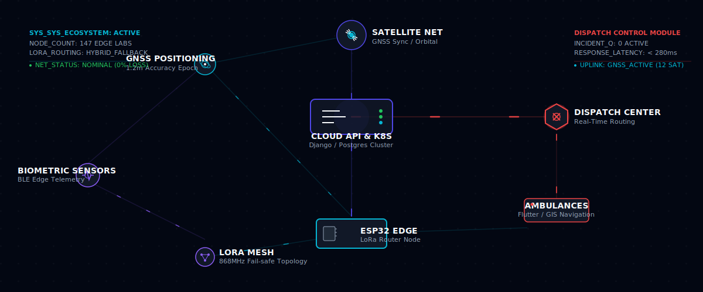
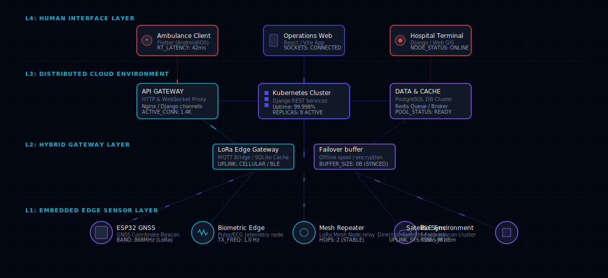
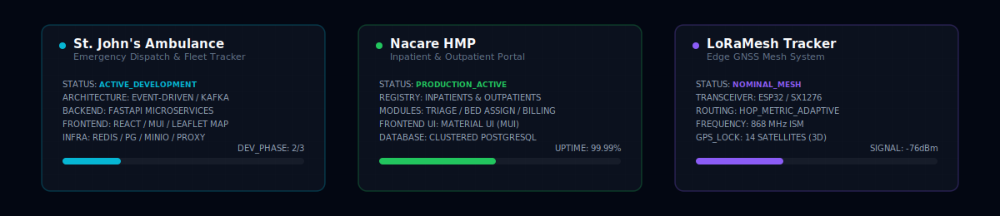

<p align="center">
  
</p>

<table width="100%" border="0" cellpadding="0" cellspacing="0">
  <tr>
    <td width="50%" valign="top">
      <h1>BUILDING MISSION-CRITICAL SYSTEMS</h1>
      <p><b>I am Clinton Agoo (agooclinton@gmail.com)</b> — Software Systems Engineer specializing in real-time emergency response infrastructure, embedded edge arrays, and scalable distributed architectures.</p>
    </td>
    <td width="50%" valign="top" align="right">
      <samp>
        <b>SYSTEM STATUS:</b> <font color="#22C55E">🟢 NOMINAL</font><br>
        <b>NETWORK TUNNEL:</b> <font color="#06B6D4">🔵 ACTIVE</font><br>
        <b>SECURITY PROTOCOL:</b> <font color="#8B5CF6">🟣 TLS 1.3</font><br>
        <b>LAST TELEMETRY UPLINK:</b> 2026-06-29T11:45:17Z
      </samp>
    </td>
  </tr>
</table>

---

## 🎛️ MISSION CONTROL PANEL

> **OPERATIONS DIRECTIVE:** Engineering systems that guarantee operation when conventional networks fail. Bridging raw embedded hardware sensors with enterprise cloud gateways to drive real-time GIS navigation and emergency dispatch.

<table width="100%">
  <tr>
    <th align="left" width="33%">🛰️ POSITIONING &amp; EDGE</th>
    <th align="left" width="33%">🧬 DISTRIBUTED ROUTING</th>
    <th align="left" width="34%">💻 TELEMETRY DISPATCH</th>
  </tr>
  <tr>
    <td>
      <ul>
        <li>GNSS / GPS Epoch Sync</li>
        <li>ESP32 Edge Microcontrollers</li>
        <li>LoRa Mesh Topology</li>
        <li>Bluetooth Low Energy Beacons</li>
      </ul>
    </td>
    <td>
      <ul>
        <li>Django REST API Clusters</li>
        <li>WebSocket Live Streams</li>
        <li>Celery Async Pipelines</li>
        <li>PostgreSQL / Redis Multi-AZ</li>
      </ul>
    </td>
    <td>
      <ul>
        <li>Flutter Navigation Suite</li>
        <li>GIS Routing Coordinates</li>
        <li>Kubernetes Pod Replicas</li>
        <li>Dockerized Containers</li>
      </ul>
    </td>
  </tr>
</table>

<p align="center">
  
</p>

## 🏗️ SYSTEMS IN PRODUCTION

The core blueprint details the hybrid network design. When cellular infrastructure fails, the system automatically falls back to an offline multi-hop LoRa mesh network, ensuring coordinate data and patient biometrics propagate to dispatch terminals.

<p align="center">
  
</p>

---

## 🛠️ TECHNOLOGY ECOSYSTEM

Rather than a simple wall of logos, Clinton's technology stack is organized by structural responsibility in the systems stack:

```ini
[EMBEDDED EDGE LAYER]
  ├── Core MCU    :: ESP32 / ESP8266 / Arduino RTOS
  ├── Telemetry   :: GNSS / GPS L1/L5 Epoch Tracker
  ├── RF Mesh     :: LoRa (868MHz / 915MHz ISM) / SX1276
  └── Sensors     :: BLE Biometrics (ECG, Heart Rate) / I2C / SPI

[ROUTING & GATEWAY]
  ├── Bridges     :: MQTT / WebSockets / HTTPS Proxy
  ├── Local Cache :: SQLite Buffer (Encrypted local storage)
  └── Cellular    :: SIM7600 4G LTE Fallback

[DISTRIBUTED CORE]
  ├── Application :: Django / FastAPI / Laravel
  ├── Sockets     :: Django Channels / WebSockets
  ├── Task Queue  :: Celery / Redis
  └── Database    :: PostgreSQL (Multi-AZ Cluster / PostGIS)

[INFRASTRUCTURE & ORCHESTRATION]
  ├── Container   :: Docker / Containerd
  ├── Orchestrator:: Kubernetes (k8s)
  ├── Host Devs   :: AWS / Cloudflare / Nginx
  └── Monitoring  :: Prometheus / Grafana / Telemetry Logs

[HUMAN INTERFACES]
  ├── Mobile App  :: Flutter (Dart) Android & iOS
  ├── Web Panel   :: React / Vite (TypeScript)
  └── UI & Styling:: Material UI (MUI) / CSS
```

<p align="center">
  
</p>

## 🛰️ MESH NETWORK TOPOLOGY

Clinton deploys custom peer-to-peer mesh routing protocols that propagate signals over multiple hops without requiring active cell towers or internet connections.

<p align="center">
  
</p>

---

## 📁 FEATURED SYSTEMS

<p align="center">
  
</p>

### 1. St. John's Ambulance Dispatch
* **Scope**: Emergency Medical Response & Real-Time Navigation Fleet.
* **Problem**: Coordinating response teams requires high-precision coordinate routing, high-throughput telemetry pipelines, and resilient message routing.
* **Solution**: Engineering a microservices-based real-time dispatch and fleet tracking platform. Utilizes FastAPI microservices connected via Apache Kafka for event-driven telemetry distribution, Redis caching, MinIO object storage for media/logs, and a unified reverse proxy entry point. Renders live tracking on Leaflet maps with React/MUI frontends.
* **Status**: `🔵 ACTIVE_DEVELOPMENT` | **Stack**: `FastAPI` `Kafka` `Leaflet` `Material UI (MUI)` `Redis` `PostgreSQL` `MinIO` `Reverse Proxy` `Microservices`

### 2. Nacare HMP (Hospital Management Platform)
* **Scope**: Complete Enterprise Inpatient & Outpatient Management Portal.
* **Problem**: Streamlining hospital check-ins, triage queues, inpatient ward allocation, and patient billing requires high data integrity and robust UI.
* **Solution**: Designed a centralized clinical panel handling inpatient admissions, outpatient registry queues, billing accounting ledgers, and check-in triage. Built with high-fidelity React interfaces utilizing Material UI (MUI), backed by Django REST APIs and Kubernetes scaling.
* **Status**: `🟢 PRODUCTION_ACTIVE` | **Stack**: `React` `Material UI (MUI)` `Django` `PostgreSQL` `Kubernetes`

### 3. LoRaMesh GNSS Tracker Node
* **Scope**: Offline GPS coordinates mesh network transmitter.
* **Problem**: Search and rescue or emergency services lack cell network links in remote environments.
* **Solution**: Engineered a low-power ESP32 firmware running an adaptive mesh routing algorithm. Broadcasts telemetry via SX1276 LoRa transceivers. Syncs coordinates using multi-constellation GNSS channels with battery optimization for 48 hours of transmission.
* **Status**: `🟣 ACTIVE_FIELD_TESTING` | **Stack**: `ESP32` `C++` `LoRa` `GNSS` `BLE` `RTOS`

---

## 📈 OPERATIONS TIMELINE

A look at the trajectory of designing, engineering, and scaling critical physical and digital infrastructure.

<p align="center">
  
</p>

---

## 🖥️ SYSTEM BOOT TELEMETRY

A simulated readout of the diagnostic sequence on startup across Clinton's engineering nodes:

<p align="center">
  
</p>

---

## 🎚️ CONTROL ROOM STATUS

<p align="center">
  
</p>

<p align="center">
  <sub>Designed &amp; engineered by <b>Clinton</b>. Built for high-reliability systems. 🚀</sub>
</p>
